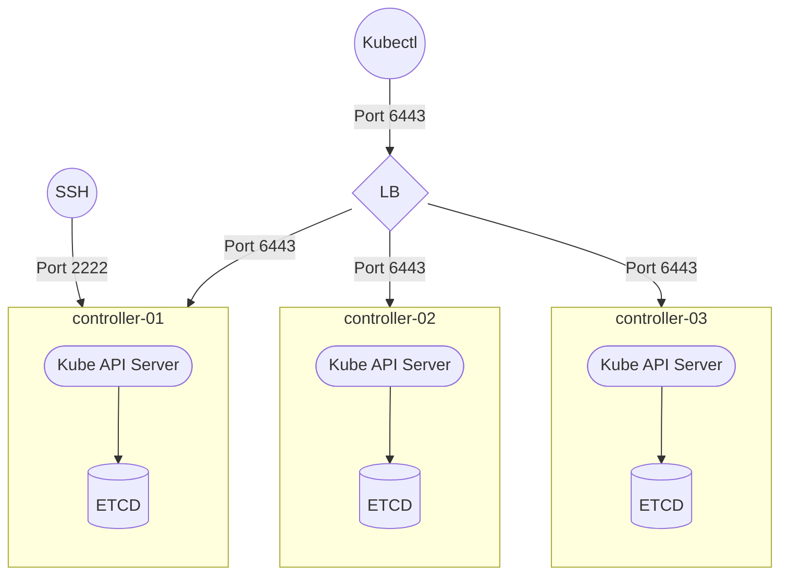
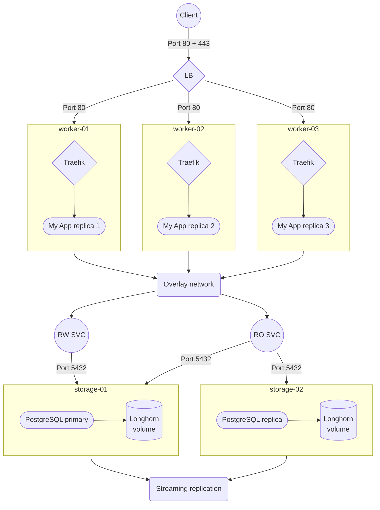

# Terraform Hetzner Cloud K3S

## 🎯 About

Get a cheap HA-ready Kubernetes cluster in less than **5 minutes**, with easy configuration setup through simple Terraform variables, 💯 GitOps way !

This opinionated Terraform template will generate a ready-to-go cloud infrastructure through Hetzner Cloud provider, optimized for [MicroOS](https://microos.opensuse.org/), with preinstalled [K3S](https://github.com/k3s-io/k3s), the most popular lightweight Kubernetes distribution.

Heavily inspired by [Kube-Hetzner](https://github.com/kube-hetzner/terraform-hcloud-kube-hetzner), but largely simplified by excluding all custom helm installs that I prefer to manage externally. It doesn't use any local/remote exec provisioners, only `cloud-init`, so quicker to set up, and `Powershell` compatible.

> For people that need a lightweight container orchestrator, the [Swarm provider](https://github.com/okami101/terraform-hcloud-swarm) should be a better fit.

## 🚀 Quick start

A valid MicroOS snapshot, identified by the selector `microos-snapshot=yes` must be available in your Hetzner Cloud account. The latest snapshot will be automatically selected by default.

## ✅ Requirements

Before starting, you need to have :

1. A Hetzner cloud account.
2. A `terraform` client.
3. A `hcloud` client.
4. A `kubectl` client.

On Windows :

```powershell
scoop install terraform hcloud
```

## 🏁 Starting

### Prepare

The first thing to do is to prepare a new hcloud project :

1. Create a new **EMPTY** hcloud empty project.
2. Generate a **Read/Write API token key** to this new project according to [this official doc](https://docs.hetzner.com/cloud/api/getting-started/generating-api-token/).

### Setup

Now it's time for initial cluster setup.

1. Copy [this kube config example](kube.tf.example) into a new empty directory and rename it `kube.tf`.
2. Execute `terraform init` in order to install the required module
3. Replace all variables according your own needs.
4. Finally, use `terraform apply` to check the plan and initiate the cluster setup.

## Topologies

Contrary to Docker Swarm which is very flexible at low prices, with many topologies possible [as explained here](https://github.com/okami101/terraform-hcloud-swarm#topologies), K8S is really thought out for HA and high horizontal scalability, with complex workloads.

### For administrators



### For clients



## 📝 License

This project is under license from MIT. For more details, see the [LICENSE](https://adr1enbe4udou1n.mit-license.org/) file.

Made with :heart: by <a href="https://github.com/adr1enbe4udou1n" target="_blank">Adrien Beaudouin</a>
